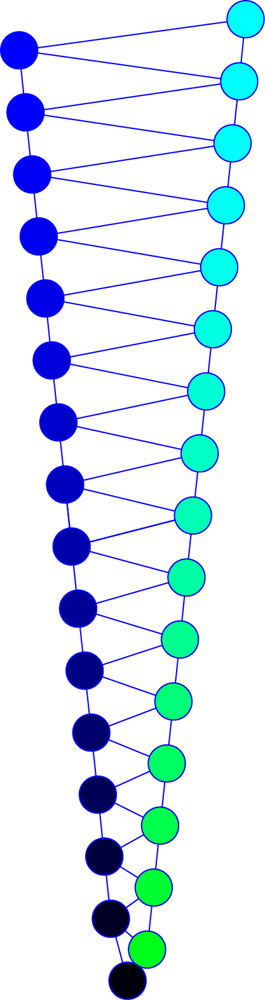

SpikeDetekt
-----------

This is a program for spike detection, that is optimized for high-channel count silicon probes.

This software was developed at the [Cortical Processing Laboratory](http://www.ucl.ac.uk/cortexlab) at UCL.

Please send feedback to Kenneth Harris (firstname at cortexlab.net), Shabnam Kadir (firstname at cortexlab.net)

Here is a quick Start Guide (will become more comprehensive with time):
--------------------------------------------------------------------------------------------------------------------------------------------------------------------------

0) Installation:
----------------

SpikeDetekt is written in Python and should work on any OS. To install it, make sure you first have Python on your computer.

We recommend you use Python 2.6 or 2.7 (don't use python 3.X!). A free academic distribution can be obtained from [Enthought Python](http://enthought.com/products/epd.php).

Once you have set up Python on your system, download and unzip/tar either the .zip file or the tarball,
go to the `spikedetekt' folder and type (on the command line):

    python setup.py install

In the above,  'python' is the necessary command on your system for calling python. The file 'setup.py' is to be found in the unzipped folder spikedetekt. 

This will install SpikeDetekt. 

1) Usage:
----------

To perform spike detection, you need:

* a .dat file (which contains your raw unfiltered electrode data), 
* a .probe file, which contains information about the electrode,
* a .params file, which contains all other parameters.

The above may have any combination of names. The name of your .params file will be the name of the folder where all the output will be stored. The simplest case is when you have the same name for all three files:

    myexperiment.dat
    myexperiment.probe
    myexperiment.params
    
This will result in output files contained in a folder with the local name: myexperiment.     

2) Probefiles:
---------------
The probe file is a text file that contains information about the spatial arrangement of electrodes on the recording probe. SpikeDetekt needs this information because it detects spikes on high-count probes as spatiotemporally continuous threshold crossings. 

The probe file must contain an "adjancy graph", the specifies all pairs of channels that are nearest neighbors. (Sometimes you will want to also include second-nearest neighbors in the graph too). 

This information is presented in the following form:

    probes = {
        1: [
            (0, 1), (0, 2),
            (1, 2), (1, 3),
            ...
            ],
        2: [
           (13,15),(13,14),...
            ],
            
        shank number: [neighbouring channel pairs
            ],
        ...
        }

The probe file is actually formatted as a python command defining dictionary variable *probes*, with one key for each shank number, and values a list of neighboring channel pairs on that shank. If you don't know Python, don't worry, just think of it as a text file with the above format. 

As a more concrete example, for the following 32 channel zig-zag probe the adjacency graph is defined by the black lines:

If there are odd channels on one edge, even channels on the other, the .probe file corresponding to the above probe would like something this: 

    probes = {
        # Probe 1
	    1:[
		    (0, 1), (0, 2),
		    (1, 2), (1, 3),
	    	(2, 3), (2, 4),
	    	(3, 4), (3, 5),
    		(4, 5), (4, 6),
    		(5, 6), (5, 7),
    		(6, 7), (6, 8),
	    	(7, 8), (7, 9),
		    (8, 9), (8, 10),
    		(9, 10), (9, 11),
    		(10, 11), (10, 12),
    		(11, 12), (11, 13),
    		(12, 13), (12, 14),
    		(13, 14), (13, 15),
    		(14, 15), (14, 16),
    		(15, 16), (15, 17),
    		(16, 17), (16, 18),
    		(17, 18), (17, 19),
	    	(18, 19), (18, 20),
    		(19, 20), (19, 21),
	    	(20, 21), (20, 22),
	    	(21, 22), (21, 23),
	    	(22, 23), (22, 24),
	    	(23, 24), (23, 25),
	    	(24, 25), (24, 26),
	    	(25, 26), (25, 27),
	    	(26, 27), (26, 28),
	     	(27, 28), (27, 29),
	    	(28, 29), (28, 30),
	    	(29, 30), (29, 31),
	    	(30, 31),
		    ]
	    }

Further examples of probe files can be found in the distribution: 

* buzsaki32.probe
* linear16.probe
* multishankslinear32.probe (an 8 shank example)

3) Parameters to adjust
----------------------------
The parameter file (with a name something like myexperiment.params) contains further information about how to detect spikes. The following parameters, specifying the probe file name, the raw data files, number of recording channels and sample rate, are compulsary:
    
    RAW_DATA_FILES = ['file1.dat', 'file2.dat','file3.dat']
    SAMPLERATE = 20000 # in Hertz
    NCHANNELS = 32
    PROBE_FILE = 'probe_filename.probe'

Note that you can specify an ordered list of .dat files, which will be concatenated before spikes are detected.

There are also a lot of optional parameters. You should specify these in your parameter file if you want to override the default parameters, whose value appears in the file spikedetekt/spikedetekt/defaultparameters.py. Note that the parameter files are also python scripts, but again you don't need to worry about this, just think of them as text files. The values of the other parameters, and their default values, are below. Feel free to ignore  

    DTYPE = "i2" # ">i2" (> means big-endian), "i4", "f2"
    # see http://docs.scipy.org/doc/numpy/reference/arrays.dtypes.html#arrays-dtypes-constructing

    # Probe file (no default value provided)
    #PROBE_FILE = 'probe_filename.probe'

    # Raw data files (no default values provided)
    #RAW_DATA_FILES = ['file1.dat', 'file2.dat']
    #NCHANNELS = 32
    #SAMPLERATE = 20000 # in Hertz

    # Output directory, files are inserted in OUTPUT_DIR/OUTPUT_NAME
    OUTPUT_DIR = None # the output directory, use params directory if None
    OUTPUT_NAME = None # the filename for created directories, use params filename if None

    # Thresholding
    USE_SINGLE_THRESHOLD = False # use a single threshold for all channels
    CHUNKS_FOR_THRESH = 5 # number of chunks used to determine threshold for detection
    THRESH_SD = 4.5 # threshold for detection. standard deviations of signal
    DETECT_POSITIVE = False # detect spikes with positive threshold crossing

    # Recording data in HDF5 file
    RECORD_RAW = True      # raw data
    RECORD_HIGH = True     # high pass filtered data
    RECORD_LOW = True      # low pass filtered data

    # Options for filtering
    F_LOW = 500. # low pass frequency (Hz)
    F_HIGH_FACTOR = 0.95 # high pass frequency as a proportion of the Nyquist freq, used to derive F_HIGH, i.e. F_HIGH = 0.95*SAMPLERATE/2 here
    BUTTER_ORDER = 3 # Order of butterworth filter
    WRITE_FIL_FILE = True # write filtered output to .fil file

    # Options for spike detection
    T_BEFORE = .0005 # time before peak in extracted spike
    T_AFTER = .0005 # time after peak in extracted spike
    T_JOIN_CC = .0005 # maximum time between two samples for them to be "contiguous" in detection step
    PENUMBRA_SIZE = 0 # mask penumbra size (0 no penumbra, 1 first neighbours, etc.)

    # Options for alignment
    USE_WEIGHTED_MEAN_PEAK_SAMPLE = True # used for aligning waves
    UPSAMPLING_FACTOR = 10 # used for aligning waves

    # Options for features
    FPC = 3 # Features per channel
    PCA_MAXWAVES = 10000 # number of waves to use to extract principal components
    SHOW_PCS = False # show principal components

    # Options for masking
    USE_FLOAT_MASKS = True
    USE_INTERPOLATION = True
    ADDITIONAL_FLOAT_PENUMBRA = 2 # adds some more penumbra
    FLOAT_MASK_THRESH_SD = (0, 4.5) # (min, max), mask 0 at min, 1 at max
    FLOAT_MASK_INTERPOLATION = 'x' # f(x) for x in [0,1], f(0)=0, f(1)=1

    # Options for computing in chunks
    CHUNK_SIZE = 20000   # number of time samples used in chunk for filtering and detection
    CHUNK_OVERLAP_SECONDS = 0.01 # overlap time (in seconds) of chunks, should be wider than spike width

    # Maximum number of spikes to process
    MAX_SPIKES = None # None for all spikes, or an int

    # Experimental options
    DO_GLOBAL_CLUSTERING = False
    SORT_CLUS_BY_CHANNEL = False # Sort clusters by the channel where the peak occurs
    
    
If you need parameters which differ from the default, include these in your myexperiment.params file. 

4) Running
----------------------------

To run the program type the following into the command line:

    python spikedetekt/scripts/detektspikes.py myexperiment.params
 
See below on how to configure your parameter file, myexperiment.params according to the specifics of your experimental setup.

5) Output
---------------

SpikeDetekt will output the following files for each shank, where n is your shank number:

+ .fet.n (feature file - required for all versions of KlustaKwik)

+ .fmask.n (float masks for using with the new masked KlustaKwik)

+ .mask.n (soon to be obsolete: binary masks for using with the new masked KlustaKwik)

+ .spk.n (spike file)

+ .upsk.n (unfiltered spike waveform)

+ .res.n (list of spike times)

+ .clu.n (a trivial clu file for use with Neuroscope, for observing spikes after detection, before clustering. Will be made redundant later)

In addition, the following file will also be output:

+ .xml (an xml file with the parameters that are needed by the data visualization programs: Neuroscope and Klusters). We now recommend using KlustaViewa for manual clustering.

+ .fil (highpass filtered data)

+ .h5 files (an [.h5](http://en.wikipedia.org/wiki/Hierarchical_Data_Format) file duplicating a lot of the above data, which will later replace the above).
  .high.h5,
  .low.h5,
  .waves.h5,
  .main.h5,
  .raw.h5. (See spikdetekt/docs/fileformat.md for more details).

